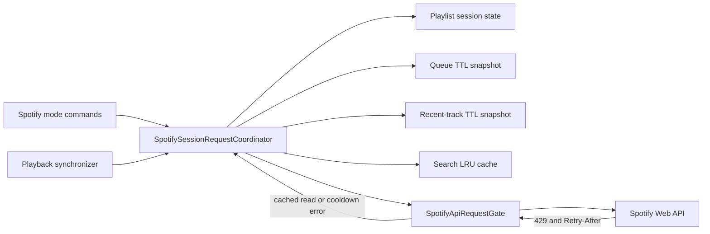

# Spotify API Throttling Design

## Status

Approved for implementation on 2026-07-12.

## Context

Spotify mode currently makes more Web API requests than its user-facing actions
suggest. The most expensive path is the background playback synchronizer: it
runs every two seconds, and `spotify_current_playback()` first calls
`spotify_account()` (`GET /me`) before reading playback state. An active
connection can therefore generate roughly 60 Spotify requests per minute before
the user searches, opens a playlist, inspects the queue, or starts playback.

Other request amplifiers are:

- one search can execute as many as five query variants;
- the first `/playlist` call pages every saved track and every track in every
  playlist in a burst;
- `/queue` and `/random` always fetch fresh remote data;
- playing a selected URI repeats account and device discovery calls even though
  Spotify mode has already validated the account, scopes, and selected device;
- independent features do not share a 429 cooldown or coalesce identical work.

The current local Spotify playlist mirrors, persisted recent-track cache, and
Spotify-mode state remain useful. This design adds bounded session caches and a
shared request gate around them instead of introducing an external cache or
service.

## Requirements

### Functional

- Search Spotify tracks and play a confirmed result without duplicate searches.
- Keep explicit Spotify result selection before playback.
- On the first `/playlist` in a CLI/WebSocket session, synchronize Spotify
  Library and Spotify playlists into the existing local mirrors.
- On later `/playlist` calls in the same session, browse the mirrors without
  making another Spotify request.
- Continue showing Spotify's playback queue in Spotify mode.
- Randomly play a recently played Spotify track.
- Preserve Spotify-mode login, Premium, scope, and device hard gates.
- Preserve actionable rate-limit messages and honor Spotify `Retry-After`.

### Non-functional

- A connected but inactive client must not poll Spotify outside Spotify mode.
- Active Spotify playback should normally use no more than one background API
  request per five seconds; idle Spotify mode should use no more than one per
  fifteen seconds.
- The progress display must remain smooth through local interpolation rather
  than faster Spotify polling.
- Identical concurrent reads must share one in-flight request.
- Paginated library synchronization must be serialized and paced.
- A 429 response must stop new Spotify requests for the reported cooldown.
- Cache state must not contain OAuth credentials and must not weaken scope or
  token-expiry validation.
- The implementation must remain local to the existing Python process and must
  not require Redis, a daemon, or a new persistent database.

## Request Budget by Feature

| Feature | Current behavior | Target steady-state behavior |
| --- | --- | --- |
| Playback sync | Two API calls every 2 seconds | One call every 5 seconds while playing; every 15 seconds while idle; none outside Spotify mode |
| Search | Up to five sequential search requests | One primary request and at most one zero-result fallback; normalized-query cache for 2 minutes |
| Confirmed play | Account, device lookup, then play | Local token/scope checks, then direct play by selected URI and session device ID |
| `/playlist` | Full paginated synchronization on first successful call; retries full work after failure | At most one synchronization attempt per session, paced and single-flight; later calls use mirrors |
| `/queue` | One remote read per invocation | One remote read per 5-second window; concurrent calls coalesce |
| Queue mutation | One write per track followed by an unconditional read | Required writes only; update/invalidate snapshot and perform at most one coalesced refresh |
| `/random` | One recent-history read per invocation | One read per 5-minute window; random choice from session or persisted fallback cache |

## Architecture

Two layers have different responsibilities:

1. `SpotifySessionRequestCoordinator` belongs to one WebSocket UI session. It
   owns feature-level snapshots, TTLs, single-flight tasks, and playlist sync
   attempt state.
2. `SpotifyApiRequestGate` is process-wide and owns outbound request spacing,
   serialization, and the shared 429 cooldown. It contains no response cache or
   user credentials.

This split keeps product freshness rules at the runner boundary while ensuring
that polling and user commands cannot independently overrun the Spotify API.

## Components

### SpotifySessionRequestCoordinator

The runner creates one coordinator for each connected UI and retains it when
Spotify mode is toggled off and on within that connection. It is discarded when
the WebSocket session ends.

It stores:

- `playlist_sync_attempted` and `playlist_sync_succeeded`;
- a queue result and monotonic expiry;
- a recent-track result and monotonic expiry;
- an LRU of up to 32 normalized search keys with monotonic expiries;
- an in-flight task per semantic cache key.

It exposes bounded operations rather than a generic cache API:

- `search_tracks(query, variants, limit)`;
- `ensure_playlist_mirrors()`;
- `get_queue(force_refresh=False)`;
- `get_recent_tracks()`;
- `invalidate_queue()`.

Failed results are not stored as normal TTL entries. A stale successful snapshot
may be returned during a rate-limit cooldown, with a visible warning. The
single-flight entry is always cleared in `finally`.

### SpotifyApiRequestGate

All Spotify HTTP calls used by the scoped features pass through one synchronous,
thread-safe gate. The gate uses `time.monotonic()` and a lock to:

- permit only one outbound Spotify request at a time;
- maintain a short minimum start interval between requests;
- record `cooldown_until` from a 429 `Retry-After` header;
- fail fast during cooldown instead of sleeping worker threads for a long time.

The initial minimum interval is 250 milliseconds. It is a protective pacing
floor, not an estimate of Spotify's unpublished quota. Normal feature caches and
reduced polling provide most of the request reduction.

If `Retry-After` is absent or invalid, the fallback cooldown is 30 seconds. A
longer existing cooldown is never shortened by a later response.

### Adaptive Playback Synchronizer

The synchronizer does nothing until Spotify mode is enabled. It calls only the
current-playback endpoint; account capability checks come from the locally
loaded token and the mode-entry hard gate.

Polling interval:

- 5 seconds while Spotify reports active playback;
- 15 seconds while playback is paused or absent;
- suspend until cooldown expiry after a 429;
- stop on a definitive login, scope, or known non-Premium failure.

Playback and control actions update the visible state immediately and request a
single prompt synchronization. The existing frontend progress writer continues
to interpolate elapsed time every second.

### Search and Confirmed Playback

Search keys use trimmed, case-folded, whitespace-normalized text. The cache TTL
is two minutes. A search performs the planned primary query first, followed by
at most one distinct fallback variant only when the first result is empty. A
rate-limit or authentication failure stops variant expansion immediately.

The selection flow passes the confirmed Spotify URI into `spotify_play`.
Playback authorization checks token presence, expiry, and required scopes
locally. When a validated session device ID is supplied, playback calls Spotify
directly instead of listing devices first. Device-name lookup outside this
session path may still list devices.

### Playlist Mirrors

The first `/playlist` call marks synchronization as attempted before starting
remote work, and concurrent `/playlist` calls await the same task. Synchronizing
continues to use maximum Spotify page sizes and the existing mirror upsert
functions. Each page passes through the shared request gate.

When synchronization succeeds, every later `/playlist` call in that WebSocket
session opens the local browser directly. When synchronization fails, later
calls still open existing local mirrors and report that the session sync failed;
they do not automatically repeat the full request burst. Starting a new CLI
session permits one new attempt.

The session cache boundary is intentionally independent from persisted Spotify
mode restoration. Restoring the mode across application starts remains
local-only, while playlist freshness is refreshed once per new connection.

### Queue Snapshot

The queue cache TTL is five seconds. Calls in the same window return the same
normalized result, and concurrent cache misses await one request. This remains a
live Spotify queue rather than falling back to Sonex's local playback queue.

After a successful `add_to_queue`, the coordinator patches the cached queue when
the URI and metadata are available; otherwise it invalidates the snapshot. A
command that adds several tracks performs the required writes serially and then
causes no more than one queue refresh.

### Recent Tracks for `/random`

Recently played tracks have a five-minute session TTL. The first `/random`
fetches remote history, normalizes and persists it through the existing recent
track cache, and chooses a playable unique URI. Later calls choose again from
the session snapshot without another read.

If the read fails or the API is cooling down, `/random` uses the existing
persisted recent-track snapshot when it contains playable Spotify URIs. It only
fails when neither remote nor cached recent history is usable.

## Error Handling and Failure Modes

| Failure | Behavior |
| --- | --- |
| Spotify returns 429 | Record cooldown, stop variant/pagination work, return a stale read snapshot when available, and show retry timing |
| Playlist sync partially completes | Do not mark success; keep already committed mirrors valid, browse existing mirrors, and do not retry in that session |
| Search cache is stale during cooldown | Return stale successful candidates with a warning; never cache an error as candidates |
| Queue cache is stale during cooldown | Show the last known Spotify queue with a warning and its stale status |
| Playback write during cooldown | Do not send the write; show remaining cooldown because silently delaying playback is surprising |
| Token expires | Local token handling refreshes it before requests; a refresh failure uses the existing login error path |
| Selected device disappears | Direct playback returns Spotify's device error; the user can leave and re-enter mode to select a device |
| Gate implementation fails internally | Return the existing stable Spotify API error; do not bypass the gate with an unpaced request |

## Security and Privacy

- Cache only normalized public track, playlist, and playback metadata already
  used by Sonex.
- Keep access and refresh tokens in the existing auth store.
- Do not log OAuth tokens, authorization headers, or raw client objects.
- Continue checking required scopes before constructing a Spotify client.
- Do not use stale cached data to claim that a write succeeded.

## Observability

Tests and debug logs should be able to distinguish `network`, `cache_hit`,
`stale_cache`, `single_flight`, and `cooldown` outcomes. User-facing activity
messages remain concise; internal counters do not become permanent TUI metrics.

## Testing Strategy

### Unit tests

- the request gate serializes callers and enforces the minimum interval;
- 429 parses integer `Retry-After`, uses the fallback for invalid values, and
  blocks later requests until the monotonic deadline;
- repeated normalized searches reuse a result;
- search makes at most two requests and stops on a non-empty first response or
  any rate-limit/auth failure;
- queue reads coalesce and obey the five-second TTL;
- recent reads obey the five-minute TTL and fall back to persisted tracks;
- confirmed URI playback skips `/me`, search, and device listing;
- current playback performs one Web API call rather than `/me` plus playback.

### Runner integration tests

- playback polling is absent outside Spotify mode and uses adaptive intervals;
- two `/playlist` calls in one session synchronize only once;
- a failed first playlist sync is not retried in the same session;
- concurrent playlist calls share one synchronization;
- queue writes cause at most one coalesced refresh;
- cooldown reads use snapshots while writes show a clear error;
- a new UI session receives a fresh playlist-sync attempt.

### Regression verification

- existing Spotify mode, playlist browsing, queue feedback, random playback,
  recommendation, auth, and frontend tests pass;
- the CLI UI build passes;
- the complete Python suite passes.

## ADR-001: Use Session Caches with a Process-wide Request Gate

### Status

Accepted.

### Decision

Use feature-specific caches scoped to a WebSocket session, plus a process-wide
thread-safe gate for pacing and `Retry-After` cooldown enforcement.

### Alternatives Considered

1. Endpoint-specific cache patches were rejected because they leave background
   polling and cross-feature concurrency uncontrolled.
2. A persistent global response cache or Redis-backed quota service was rejected
   because it adds stale-state, migration, and operational complexity that a
   local CLI does not need.

### Consequences

Positive consequences are substantially fewer calls, shared cooldown behavior,
testable freshness contracts, and no new service dependency. Negative
consequences are modest coordinator state in the runner and the possibility of
showing explicitly marked stale read data during a cooldown. Session caches are
lost at disconnect by design.

## ADR-002: Prefer Local Validation and Direct URI Playback

### Status

Accepted.

### Decision

After Spotify mode has passed its hard gate, validate token presence, expiry,
and scopes locally and send confirmed URIs directly to the selected device.
Avoid repeated `/me` and device-list calls on hot playback paths.

### Alternatives Considered

Rechecking account product and enumerating devices before every write was
rejected because it multiplies requests but cannot eliminate races: the account
or device may still change immediately after validation. Spotify's write
response remains the authoritative runtime check.

### Consequences

Playback uses fewer requests and starts faster. A device that disappears after
mode entry is detected by the playback request rather than by a preceding list
request, producing the same actionable recovery path with one fewer API call.
