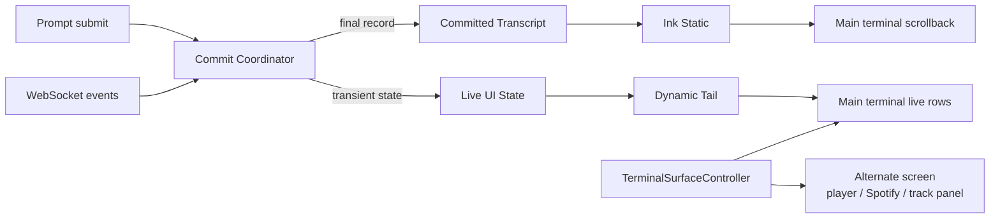

# Terminal-Native Append Rendering Design

## Status

Approved in conversation on 2026-07-25.

## Problem

Sonex currently renders its chat UI as a terminal-height Ink tree. When the
rendered output reaches the terminal height, Ink takes its full-screen clear
path. Sonex's incremental frame writer reduces repeated repaint cost, but the
application still owns a virtual viewport rather than producing normal terminal
history. As a result, users cannot use the terminal's native scrollback to see
the shell output that preceded Sonex or the complete Sonex conversation.

The desired experience is similar to a shell command that keeps printing
downward:

- finalized conversation records become immutable terminal history;
- the input and other live interaction remain editable below the latest record;
- the terminal owns wheel scrolling, its scrollbar, selection, and copy;
- explicitly full-screen playback surfaces remain temporary and do not pollute
  the main terminal history.

This design supersedes the measured virtual-conversation flow in
`2026-07-24-flowing-chat-input-design.md` and ADR
`2026-07-24-adr-measured-conversation-flow.md`. It also supersedes the part of
`2026-07-24-native-scrollback-wheel-design.md` that retained application-managed
PageUp and PageDown history.

## Requirements

### Functional

- Do not clear the main terminal when Sonex starts.
- Preserve terminal output that existed before Sonex launched.
- Permanently append finalized user messages, agent messages, errors,
  dismissal notices, and runtime information snapshots.
- Keep status text, activity progress, launch animation, command suggestions,
  confirmation flows, setup flows, and input editing in a dynamic tail.
- Place the dynamic tail immediately after the latest committed output. It is
  not pinned to the bottom when the conversation is short.
- Let content reaching the terminal bottom advance through native terminal
  scrolling.
- Use the terminal's native wheel, scrollbar, selection, copy, and
  `Shift+PageUp`/`Shift+PageDown` behavior.
- Remove Sonex's virtual chat-history viewport, scroll offset, 80-record display
  cap, and application-managed PageUp/PageDown history.
- Preserve the current Sonex runtime banner, message subjects and markers,
  colors, Spotify theme, input dock shape, cursor navigation, and interaction
  semantics.
- Use the alternate screen only for the mini player, Spotify immersive mode,
  and full-screen track panels.
- Restore the main screen and its scrollback exactly after leaving an
  alternate-screen surface.

### Non-Functional

- The amount of terminal output produced by a live-state update must not grow
  with committed transcript length.
- A committed record is immutable and is written to the terminal once.
- Main-screen resize must not clear or replay committed history.
- Previously committed records keep their commit-time layout; the dynamic tail
  and future records use the new width.
- Frontend transcript memory may grow linearly with text produced during the
  current process, but there is no arbitrary UI record cap. Memory is released
  on exit.
- User and model content must always pass through Ink text rendering. It must
  never be written as untrusted raw ANSI.
- Normal, Spotify, login, setup, and confirmation event payloads keep their
  existing WebSocket shapes.
- Session persistence and Python-side transcript formats remain unchanged.
- Terminal cleanup must be idempotent across normal exit, SIGINT, SIGTERM,
  renderer failure, and repeated disposal.
- Non-TTY output must not emit alternate-screen, mouse-reporting, or cursor
  control sequences.

## Current Architecture

The current source has four coupled mechanisms:

1. `App` owns a capped `chatTimelineReducer` with `scrollOffset`.
2. `ConversationColumn` measures the available terminal region and
   `ChatPane` renders a selected virtual window.
3. the application root is assigned terminal width and height;
4. `createIncrementalStdout` converts Ink full-screen frames into changed-row
   updates.

This architecture improves redraw behavior but still makes the application the
owner of history. Native scrollback only sees screen frames and cannot act as
the authoritative transcript.

The Python WebSocket adapter already sends each accepted user input back as a
`chat` event with `role: "user"`. The new frontend therefore needs an explicit
echo-reconciliation boundary if it commits a user message immediately on
submit.

## Selected Architecture

Use Ink's permanent static output for committed history, followed by a small
dynamic tail. Coordinate explicit full-screen regions with an atomic terminal
surface controller.



### Committed Transcript

Introduce an append-only frontend record with:

- a monotonically increasing local sequence;
- the existing `ChatItem` semantic payload;
- commit-time metadata required for a stable key;
- no update or removal operation.

`MainChatSurface` renders:

```tsx
<>
    <Static items={committedRecords}>
        {(record) => <CommittedRecord key={record.sequence} record={record} />}
    </Static>
    <DynamicTail {...liveState} />
</>
```

There is no terminal-height root, content viewport, hidden overflow region, or
bottom-filling spacer. Ink writes only newly appended `Static` items as
permanent output and uses its normal line-erasing update path only for the
dynamic tail.

`CommittedRecord` reuses the current `HeaderFrame` and chat-message visual
components. A record is laid out using the terminal width at the time it is
committed. Once written, later React state and resize events cannot modify it.

### Dynamic Tail

The dynamic tail owns state that is expected to change in place:

- mini mascot status;
- the existing bordered input dock and model/mode row;
- current status and activity;
- slash-command suggestions;
- confirmation and setup choices;
- help, language, and model-selection interactions that do not require a
  full-screen surface.

The tail begins immediately after the latest committed record. As its height
changes, Ink erases and redraws only those live rows. It is never represented
as a transcript item.

### Commit Coordinator

Centralize event classification instead of appending from many independent
branches.

The coordinator accepts:

- local prompt submissions;
- localized WebSocket events;
- local system/error notices;
- explicit runtime information snapshots.

It returns either:

- an immutable transcript record;
- a transient live-state update;
- an alternate-surface transition;
- no transcript change.

This keeps all commit decisions testable without terminal I/O.

### User Echo Reconciliation

The UI must show a submitted prompt immediately, but the backend already echoes
that prompt as a `chat:user` event.

On local submission:

1. trim and validate the input using the existing rules;
2. append a committed user record;
3. increment a `PendingEchoLedger` count for the normalized text;
4. clear the input and send the unchanged `user_input` event.

On `chat:user`:

1. if the ledger contains a count for the same normalized text, decrement it
   and do not append another record;
2. otherwise append the event as a server-originated user record.

Counts handle repeated identical prompts without requiring event IDs or a
WebSocket schema change. Pending counts live only for the current frontend
process. A send or connection failure does not remove the already visible user
record; the UI appends a separate error record.

### Terminal Surface Controller

Construct a `TerminalSurfaceController` before the Ink root is mounted and pass
it to `App`. After `render()` returns, attach the returned `clear` function to
the controller.

The controller owns:

- current surface: `main` or `alternate`;
- Ink live-output clearing;
- entering and leaving the alternate screen;
- resetting the incremental frame cache;
- idempotent terminal cleanup.

Entering an alternate surface is ordered as follows:

1. clear the current Ink dynamic output through the attached `app.clear()`;
2. reset the incremental frame cache;
3. mark the controller as alternate so a partial write can still be restored;
4. emit enter-alternate-screen and clear/home sequences;
5. commit the React region-state transition.

Leaving is ordered as follows:

1. clear the current alternate-screen Ink output;
2. reset the incremental frame cache;
3. emit leave-alternate-screen;
4. mark the controller as main;
5. commit the React transition back to chat, causing a fresh dynamic-tail
   render below the preserved static history.

Switching between two alternate-screen regions remains within the alternate
screen: clear live output, reset the frame cache, clear the alternate screen,
and commit the new region.

The controller ignores duplicate transitions and exposes one `dispose()` path
used by normal exit and signal cleanup.

### Incremental Frame Writer

The main chat surface must no longer depend on full-screen frame rewriting.
The stdout proxy passed to Ink intentionally does not expose `rows`. Ink 5
otherwise enters a destructive `clearTerminal + fullStaticOutput` branch when
dynamic output reaches the reported terminal height, which clears native
scrollback and replays the complete Static transcript.

Keep the incremental frame writer for full-screen alternate surfaces, where
cursor or playback state may otherwise repaint the entire alternate buffer.
Change its construction API so the entrypoint retains an explicit `reset()`
handle. The terminal surface controller calls this handle before every buffer
or full-screen-region transition. Pass the real `process.stdout` to `App`
separately for dimensions, resize events, TTY detection, and direct playback
writers. Alternate Ink regions reserve the terminal's final row so log-update's
trailing newline cannot scroll the alternate buffer.

### Terminal Input

Do not enable mouse reporting. Keep the one-time defensive disable sequence at
startup, before Ink renders, to recover from a previous abnormal process exit.

Pass `process.stdin` directly to Ink. Remove PageUp and PageDown chat reducers.
Ordinary mouse-wheel gestures then remain terminal-native and produce neither
input events nor Sonex output.

## Detailed Event Flows

### Startup

1. Create the surface controller and reset stale mouse-reporting modes.
2. Create incremental stdout, hide its `rows` value from Ink, and retain its
   reset handle.
3. Render the main Ink root without clearing or sizing it to terminal height.
4. Attach the Ink `clear()` callback to the surface controller.
5. When the initial runtime-info event arrives, commit one immutable
   `HeaderFrame`.

Pre-existing terminal lines remain above Sonex and stay in scrollback.

### Agent and System Messages

- `chat:agent`, non-echo `chat:user`, local errors, and muted dismissal notices
  each append one committed record.
- `/info` appends a new committed runtime-info snapshot.
- `status`, `activity`, launch animation, focus, and input-lock changes update
  only the dynamic tail.
- A transient status is not copied into history merely because it reaches a
  success or error state. If a permanent summary is required, it must arrive
  through the existing chat/system-notice path.

### Resize

- Do not clear, remeasure, or replay `Static` history.
- Let the terminal retain the existing physical history as rendered.
- Re-render the dynamic tail using the new width.
- Render every future committed record using the new width.
- Within the alternate screen, reset the frame cache and allow a complete
  surface redraw.

### Exit and Failure

`dispose()` performs best-effort, idempotent cleanup:

1. leave the alternate screen if active;
2. disable SGR and button-event mouse reporting;
3. restore cursor visibility;
4. reset renderer caches;
5. allow the process to exit.

On signal exit, unmount Ink while still in the current terminal buffer, then
dispose the controller. This prevents Ink's final render from writing an
alternate-region frame after the controller has already restored the main
buffer.

If WebSocket send fails after a local user commit, retain the prompt and append
an error record. If an alternate renderer throws, cleanup occurs in `finally`
before the error is surfaced.

For non-TTY output, the controller never enters the alternate screen and never
emits cursor or mouse sequences. Direct progress/status writers are gated by
the physical stdout's TTY state, and the renderer-facing stdout adapter removes
Ink `log-update` erase-line, styling, and cursor-motion sequences from pipe
output. Ink remains in its normal Static mode, so committed records are still
written exactly once. Existing non-interactive behavior remains the fallback.

## Migration Boundaries

### Remove or Retire

- the transcript portion of `chatTimelineReducer`;
- `chatScrollOffset` and maximum chat-scroll-offset state;
- `ChatPane` virtual-window rendering;
- `ConversationColumn` measurement and `conversation-flow`;
- PageUp/PageDown application history input;
- main-chat calls to `clearTerminalForLayoutSwitch`;
- the `MAX_CHAT_ITEMS` UI transcript cap.

`trimList` is still useful for bounded activity and other non-transcript data.
Move that generic helper out of `chat-window.ts` before retiring chat-window
logic.

### Preserve

- current chat, banner, input, confirmation, setup, selector, and Spotify
  visual components;
- the current WebSocket and Python event contracts;
- session-save and transcript formats;
- playback routing and keyboard controls;
- mini-player and Spotify immersive functionality;
- defensive startup mouse-disable behavior;
- compiled `src/cli-ui/dist` as the runtime artifact used by `scripts/sonex`.

## Alternatives Considered

### Custom Codex-Style Inline History Writer

Create a semantic-cell renderer and manually insert history with cursor moves,
scroll regions, reverse index, terminal wrapping, and compatibility branches.

This offers the most viewport control, but it would require Sonex to maintain a
small terminal engine and duplicate or replace existing Ink component
rendering. Codex's implementation contains terminal- and multiplexer-specific
paths, demonstrating the operational cost. This is not justified for Sonex's
current requirements.

### Separate Main and Alternate Ink Roots

Lift App state into a shared store and mount independent Ink renderers for the
main and alternate screens.

This provides natural output-cache isolation, but requires a broad state,
WebSocket, input, and lifecycle refactor. A single renderer plus explicit
`app.clear()` and cache resets provides the required isolation with a much
smaller change.

### Keep the Virtual Full-Screen Chat

Continue using a terminal-height tree and improve the incremental writer.

This can reduce flicker but cannot make terminal scrollback the authoritative
history or preserve pre-launch shell output, so it does not meet the goal.

## Testing and Acceptance

### Pure State Tests

Cover:

- monotonically increasing committed record IDs;
- immutable append semantics;
- classification of permanent and transient events;
- repeated identical local prompts and matching server echoes;
- unmatched server-originated user messages;
- send failure after local commit;
- no transcript cap.

### Component Contract Tests

Verify:

- the main chat surface contains `Static` followed by `DynamicTail`;
- committed records reuse existing message and banner renderers;
- the main root has no terminal-height assignment;
- `ChatPane`, `scrollOffset`, virtual windowing, and conversation measurement
  are absent;
- ordinary and Spotify chat share the same append architecture;
- dynamic panels do not enter committed history.

### Terminal Surface Tests

With a fake writer and renderer-clear callback, verify:

- the exact enter, alternate-to-alternate, leave, and dispose order;
- repeated enter/leave/dispose calls are idempotent;
- cache reset occurs before each buffer transition;
- renderer-facing stdout does not expose terminal rows;
- main chat never emits whole-screen clear sequences;
- alternate surfaces never receive replayed main-screen Static history;
- non-TTY mode emits no terminal-control sequences.

### PTY Verification

Run the compiled entrypoint in a real 80x24 PTY and:

- print a unique shell marker before launching Sonex;
- verify startup and ordinary chat do not emit `ESC[2J` or `ESC[3J`;
- append enough records to exceed the terminal height;
- verify wheel input produces no Sonex stdin event or stdout update;
- verify PageUp no longer changes an application history offset;
- enter and leave each alternate-screen region;
- verify the main transcript and dynamic tail are restored;
- terminate from both main and alternate surfaces and inspect cleanup bytes;
- verify no clear, alternate content, or transcript replay appears after the
  leave-alternate-screen sequence.

A PTY can prove byte-level behavior, but native scrollbar, selection, copy, and
terminal reflow require a real terminal emulator smoke check.

### Integrated Verification

Run:

```bash
git diff --check
npm --prefix src/cli-ui test
npm --prefix src/cli-ui run build
.venv/bin/python -m pytest -q
```

Inspect compiled `src/cli-ui/dist/index.js` and run `scripts/sonex` because the
real launcher uses the compiled artifact.

## Risks and Mitigations

- **Duplicate user messages:** reconcile existing backend echoes with a
  text-count ledger.
- **Main history erased after alternate mode:** always call attached
  `app.clear()` and reset the frame writer before switching buffers.
- **Static/dynamic classification drift:** centralize all decisions in one pure
  commit coordinator.
- **Resize expectations:** document immutable commit-time layout and never
  replay scrollback.
- **Long-session memory growth:** accept linear current-session text storage;
  avoid retaining rendered component trees or frame snapshots.
- **Raw control-sequence injection:** render all record content through Ink
  components and reserve direct stdout writes for trusted terminal lifecycle
  constants.
- **Dirty terminal after crash:** use one idempotent cleanup path and retain the
  defensive mouse-disable write at the next startup.

## Non-Goals

- Re-rendering or reflowing old scrollback after resize
- Adding an in-application scrollbar or history search
- Keeping application-managed PageUp/PageDown history
- Persisting frontend layout or terminal cells
- Changing message styling or redesigning the input dock
- Changing WebSocket or session persistence schemas
- Replacing Ink or implementing Codex's custom terminal history engine
- Changing playback, provider, or Spotify routing

## References

- `docs/superpowers/specs/2026-07-24-flowing-chat-input-design.md`
- `docs/superpowers/specs/2026-07-24-native-scrollback-wheel-design.md`
- `docs/superpowers/specs/2026-07-24-adr-measured-conversation-flow.md`
- `src/cli-ui/src/index.tsx`
- `src/cli-ui/src/terminal-frame-writer.ts`
- `src/ws/ui.py`
- [Ink Static output](https://github.com/vadimdemedes/ink#static)
- [Codex terminal history insertion](https://github.com/openai/codex/blob/main/codex-rs/tui/src/insert_history.rs)
